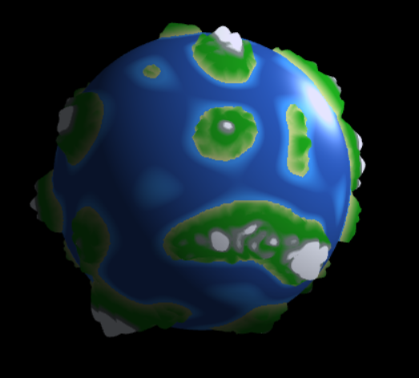
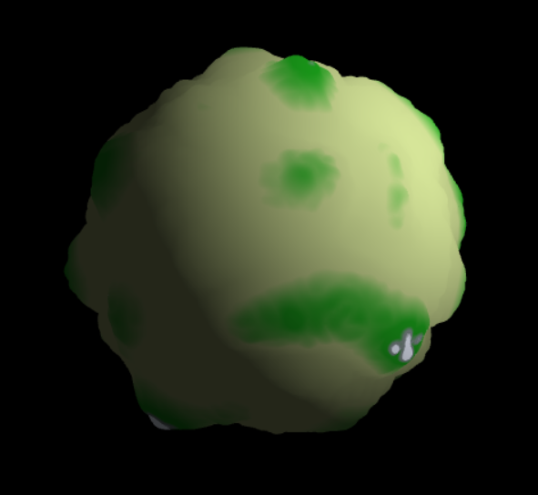
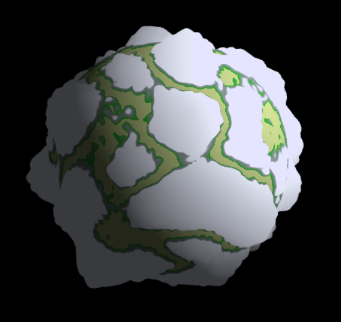
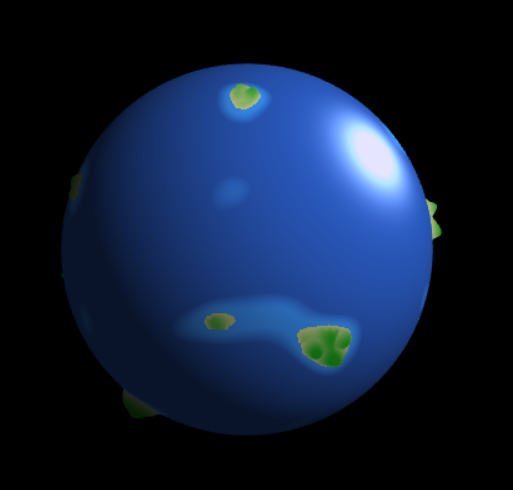
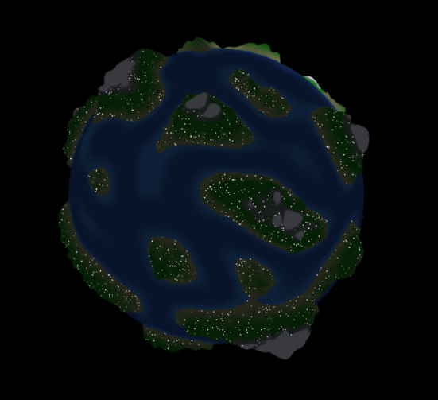
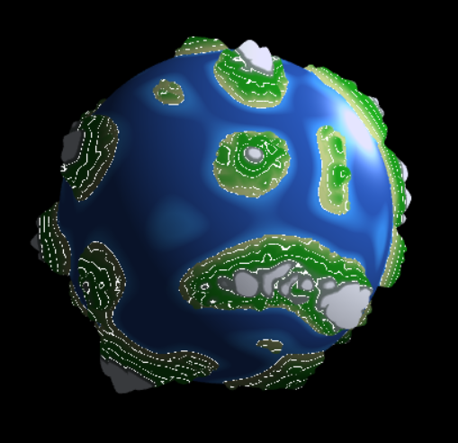

# CIS 566 Project 1: Noisy Planets

# Wanru Zhao, 59981278

## Citation
- Perlin noise function reference: Perlin noise demo code, made adaption to 3D
- [Implicit Procedural Planet Generation](https://static1.squarespace.com/static/58a1bc3c3e00be6bfe6c228c/t/58a4d25146c3c4233fb15cc2/1487196929690/ImplicitProceduralPlanetGeneration-Report.pdf)

## GitHub.io Demo
- [Planet Demo](https://wanruzhao.github.io/homework-1-noisy-planets-WanruZhao/)

## Screenshot
 
 
 

## Features
- Used Perlin noise to generate noisy terrain on planet. Applied two kinds of Perlin noise as an offset along vertices' normal direction.
- Implemented biomes: ice, rock, forest, sand, sea and deep sea. Determined biome type according to elevation of terrain and used mixed colors to smoothly transit one biome to another (except for sand and sea).
- Applied Lambertian reflection to sand, forest and rock. And applied Blinn-Phong reflection ice, sea and deep sea.
- Used time to make changes of terrain based on time.
- UI
  - Speed: used to control speed of terrain changing
  - Temperature: used to change biomes
  - Humidity: used to change biomes
  - Level of detail: apply more noise on current terrain
  - Light density: control city light density on the night side
  - Contour line: show contour line of terrain
- Used temperature and humidity to change the biome distribution, create iceberg, desert, ocean and several reasonable cases.
- Check contour line will automatically turn off city lights.
